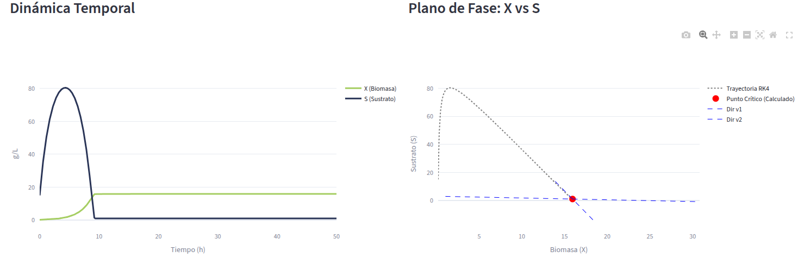

# BioReact-Lite: Simulation Engine and Stability Analysis 🧪

**BioReact-Lite** is an interactive platform designed for the dynamic exploration of continuous bioreactors (chemostats). This tool allows for modeling microbial growth, predicting system behavior under various operating conditions, and performing rigorous local stability analysis using non-linear systems dynamics tools.

---

## 🖼️ Application Preview

  
   
   
  

---

## 🧠 Calculation Fundamentals

The core of BioReact-Lite is based on coupled mass balance modeling and linear stability analysis at the equilibrium point.

### 1. Kinetic Model (Monod)

The engine uses the Monod kinetics to describe the specific growth rate ($\mu$), which relates biomass growth to the concentration of the limiting substrate:

$$\mu(S) = \frac{\mu_{max} \cdot S}{K_s + S}$$

Where:

* **$\mu_{max}$**: Maximum specific growth rate ($h^{-1}$).
* **$K_s$**: Substrate saturation constant ($g/L$).

### 2. System of Ordinary Differential Equations (ODE)

Reactor dynamics are governed by two fundamental mass balances that define the change in biomass ($X$) and substrate ($S$) over time:

* **Biomass Balance ($f_1$):**

$$\frac{dX}{dt} = f_1(X, S) = X(\mu(S) - D)$$

* **Substrate Balance ($f_2$):**

$$\frac{dS}{dt} = f_2(X, S) = D(S_r - S) - \frac{\mu(S) \cdot X}{Y_{x/s}}$$

In these equations, **$D$** represents the dilution rate, **$S_r$** the feed substrate concentration, and **$Y_{x/s}$** the biomass-to-substrate yield.

### 3. Numerical Integration (Runge-Kutta 4)

To solve the coupled system of ODEs, the application implements the **4th Order Runge-Kutta (RK4)** method. This method calculates four intermediate slopes ($k_1$ to $k_4$) at each time step ($\Delta t$) to obtain a high-precision approximation of the $X$ and $S$ trajectories.

---

## 🔍 Local Stability Analysis

The application does more than simulate curves; it analyzes the mathematical nature of equilibrium points using the **First Method of Lyapunov**.

### Jacobian Matrix ($J$)

A sensitivity matrix (Jacobian) is constructed to linearize the non-linear system in the neighborhood of the steady state ($\hat{X}, \hat{S}$):

$$J = \begin{bmatrix} \frac{\partial f_1}{\partial X} & \frac{\partial f_1}{\partial S} \\ \frac{\partial f_2}{\partial X} & \frac{\partial f_2}{\partial S} \end{bmatrix}$$

### Eigenvalues ($\lambda$) and Eigenvectors ($v$)

* **Eigenvalues**: Determine stability. If the real part of all $\lambda$ is negative ($Re(\lambda) < 0$), the system is **locally stable** and will return to equilibrium after a perturbation.
* **Eigenvectors**: Define the "directions" of approach or departure in the phase plane, showing how the system evolves toward the steady state.

---

## 🕹️ Application Features

BioReact-Lite is divided into three main interaction zones:

### 1. Control Panel (Sidebar)

Allows the user to manipulate the simulation environment with a precision of three decimal places:

* **Physiological Tuning**: Modify biological parameters such as $\mu_{max}$, $K_s$, and $Y_{x/s}$.
* **Operational Control**: Change the dilution rate ($D$) and substrate feed ($S_r$) to observe phenomena like **washout** (biomass washout).
* **Numerical Configuration**: Set initial conditions ($X_0, S_0$) and the integrator step size ($dt$).

### 2. Dynamic Visualization

* **Time Series**: Interactive plots showing the evolution of biomass and substrate until reaching (or failing to reach) steady state.
* **Phase Plane**: An $S$ vs $X$ view plotting the simulation trajectory, the calculated critical point, and the eigenvectors guiding the system dynamics.

### 3. Educational & Technical Module

* **Real-Time Analysis**: Displays the calculated Jacobian matrix and Lyapunov stability results.
* **Step-by-Step Guide**: A pedagogical breakdown explaining the fundamental equations and the mathematical procedure the app executes in the background.

---

## 🚀 Local Installation

If you wish to run this simulator on your own machine:

1. Clone the repository: `git clone https://github.com/ebalderasr/BioReact-Lite.git`
2. Create a virtual environment: `python3 -m venv venv`
3. Install dependencies: `pip install -r requirements.txt`
4. Run the app: `streamlit run app.py`

---

**Developed by:** **Emiliano Balderas Ramírez** Biotechnology Engineer | PhD Student in Biochemistry

*Institute of Biotechnology, UNAM*